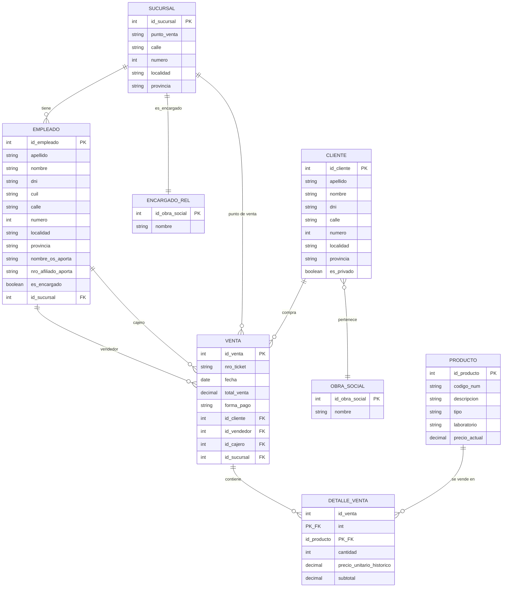

# Trabajo Práctico Cursada - Base de Datos II - Grupo Y

**Integrantes:**
- Rodrigo Gabriel Funes
- Anahí Maitén Mansilla
- Marcos Fernando Tambosco
- Dante Zulli

**Docentes:** Prof. Federico Ribeiro / Inst. Franco Aguirre

**Materia:** Base de Datos 2 - TP de cursada

**Departamento de Desarrollo Productivo y Tecnológico**

**LICENCIATURA EN SISTEMAS**

---

## Descripción

Trabajo Práctico Integrador de la materia Bases de Datos II (UNLa). El objetivo es analizar un problema de base de datos desde un enfoque NoSQL, partiendo de un modelo relacional (ERD) para luego generar documentos JSON autocontenidos y almacenarlos en MongoDB.

**Dominio del problema:** una cadena de farmacias que necesita informatizar su operatoria (ventas, productos, clientes, empleados y sucursales).

## Cómo levantar el proyecto

```bash
# 1. Iniciar MongoDB
podman-compose up -d

# 2. Ejecutar la API
./mvnw spring-boot:run
```

La API arranca en `http://localhost:8080`

---

## Diagrama Entidad-Relación (ERD)


